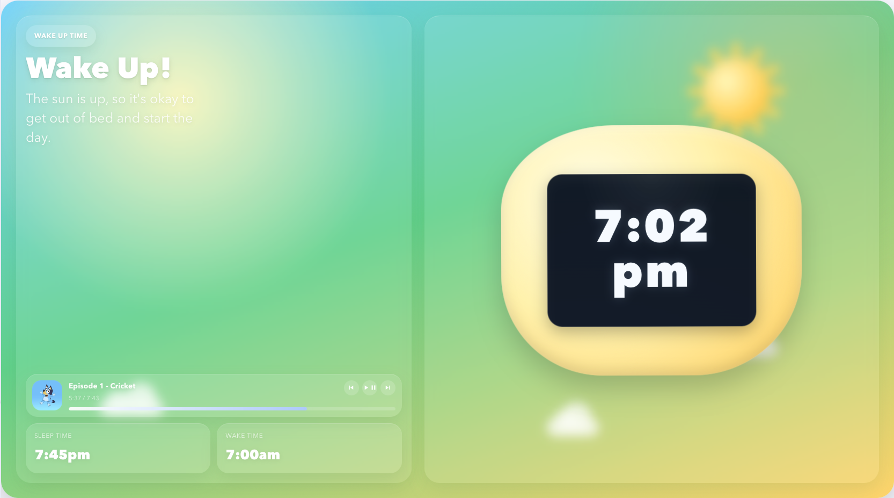

# Kids Wake Up Clock Card

A large-format Lovelace card for Home Assistant that turns a tablet or smart display into a kid-friendly wake-up clock.

It is inspired by products like the GroClock, but built as a flexible custom card with:

- automatic day and night modes
- a large easy-to-read clock
- configurable wake and sleep times
- built-in visual editor support
- optional media playback tile and controls
- burn-in protection for always-on displays

The design is code-based, so you do not need background assets or separate image packs to get started.

## Why This Card

This card is designed for devices that stay visible all day in a child’s room, such as:

- iPads mounted on a wall
- Echo Show style dashboards
- Android tablets running Home Assistant
- bedside control panels

During sleep hours it switches to a darker nighttime scene. During wake hours it changes to a brighter daytime scene. The goal is simple: make it visually obvious when it is okay to get up.

## Features

- Full-width, panel-friendly layout for tablets and smart displays
- Automatic switching between day mode and night mode
- Large live clock with optional seconds and date
- Configurable wake and sleep times
- 12-hour or 24-hour time support
- Custom titles, labels, and helper text
- Adjustable title and message font sizes
- Optional now-playing tile for a Home Assistant `media_player`
- Optional media controls for previous, play/pause, and next
- Built-in visual editor in Home Assistant
- Day and night color customization
- Smooth animations
- Burn-in protection with subtle clock-face shifting
- Optional night dimming for always-on displays

## Screenshots

Day Mode
```md

```

## Install

### HACS

1. In HACS, add it as a custom frontend repository.
2. Install `Kids Wake Up Clock Card`.
3. Refresh your browser.
4. Add the card to a dashboard.

### Manual

1. Copy [kids-wake-up-clock-card.js](/Users/jamie/Desktop/kids-sleep-clock/kids-wake-up-clock-card.js) into your Home Assistant `config/www/` folder.
2. In Home Assistant, go to `Settings -> Dashboards -> Resources`.
3. Add a new resource:

```text
/local/kids-wake-up-clock-card.js
```

4. Set the resource type to `JavaScript Module`.

## Quick Example

```yaml
type: custom:kids-wake-up-clock-card
wake_time: "07:00"
sleep_time: "18:00"
title_awake: "Wake Up!"
title_sleep: "Sleep Time"
day_label: "Wake Up Time"
night_label: "Sleepy Time"
awake_message: "The sun is up, so it's okay to get out of bed and start the day."
sleep_message: "The moon is out, so it's time to rest and stay in bed."
title_font_size: 3.4
message_font_size: 1.1
media_player_entity: media_player.kids_room
show_media_controls: true
burn_in_protection: true
burn_in_shift_px: 2
night_burn_in_dimming: true
show_seconds: true
show_schedule: true
show_date: true
hour12: true
animate: true
```

## Full Panel Example

For a dedicated kids-room display, use it inside a panel view:

```yaml
views:
  - title: Kids Clock
    path: kids-clock
    panel: true
    cards:
      - type: custom:kids-wake-up-clock-card
        wake_time: "07:00"
        sleep_time: "18:00"
```

## Visual Editor

Once the resource is loaded, Home Assistant should show a visual editor when you add or edit the card. The editor exposes:

- wake and sleep times
- day and night titles
- title and message font sizes
- day and night badge labels
- custom helper text for each mode
- optional media player integration
- optional media transport controls
- burn-in protection settings
- date, seconds, schedule, and animation toggles
- day and night color controls

You can still use YAML whenever you want, but routine customization should be possible directly from the UI.

## Configuration

| Option | Required | Default | Notes |
| --- | --- | --- | --- |
| `wake_time` | Yes | - | Time when wake mode starts, in `HH:MM` |
| `sleep_time` | Yes | - | Time when night mode starts, in `HH:MM` |
| `title_awake` | No | `Good morning!` | Main heading for wake mode |
| `title_sleep` | No | `Shhh... it's still nighttime` | Main heading for sleep mode |
| `title_font_size` | No | `3.1` | Maximum title size in `rem` |
| `day_label` | No | `Wake Up Time` | Small badge text for day mode |
| `night_label` | No | `Sleepy Time` | Small badge text for night mode |
| `awake_message` | No | Built-in day message | Supporting text for wake mode |
| `sleep_message` | No | Built-in night message | Supporting text for sleep mode |
| `message_font_size` | No | `1.2` | Maximum message size in `rem` |
| `media_player_entity` | No | empty | Shows a now-playing tile only while this media player is in `playing` state |
| `show_media_controls` | No | `false` | Show previous, play/pause, and next buttons in the now-playing tile |
| `burn_in_protection` | No | `true` | Enables tiny periodic clock-face shifts to reduce static pixel wear |
| `burn_in_shift_px` | No | `2` | Maximum clock-face shift amount in pixels |
| `night_burn_in_dimming` | No | `true` | Slightly dims and softens the display during night mode |
| `show_seconds` | No | `true` | Show seconds in the clock |
| `show_schedule` | No | `true` | Show sleep and wake time panels |
| `show_date` | No | `true` | Show the current date |
| `hour12` | No | `true` | Use 12-hour time instead of 24-hour |
| `animate` | No | `true` | Turn floating and twinkling animations on or off |
| `locale` | No | `default` | Locale used for time and date formatting |
| `day_background_start` | No | `#7bd7ff` | Day gradient start color |
| `day_background_mid` | No | `#82d6c4` | Day gradient middle color |
| `day_background_end` | No | `#ffd976` | Day gradient end color |
| `night_background_start` | No | `#10162f` | Night gradient start color |
| `night_background_mid` | No | `#1e2853` | Night gradient middle color |
| `night_background_end` | No | `#334d89` | Night gradient end color |
| `shell_day_start` | No | `#fffde7` | Outer clock shell highlight in day mode |
| `shell_day_end` | No | `#ffd56a` | Outer clock shell base in day mode |
| `shell_night_start` | No | `#ecf2ff` | Outer clock shell highlight in night mode |
| `shell_night_end` | No | `#99afff` | Outer clock shell base in night mode |

## Publish Checklist

Before publishing to GitHub, it is worth doing these last few things:

- add screenshots under `docs/screenshots/`
- create a repository description
- tag the first release as `v1.0.0`
- add release notes
- submit it to HACS as a custom frontend repository

## Notes

- This is a Lovelace frontend card, not a Home Assistant integration.
- The media tile appears only when the configured media player is actively playing.
- Burn-in protection is intentionally subtle so the card still feels stable on a bedroom display.

## License

This project is licensed under the MIT License. See [LICENSE](/Users/jamie/Desktop/kids-sleep-clock/LICENSE).
